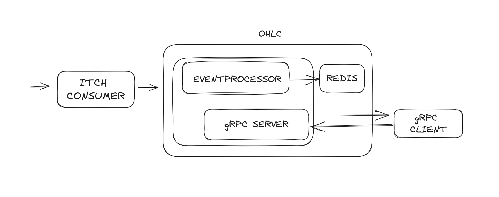

# OHLC Feed Engine
## Diagram

## OHLC Flow
1. Using Redpanda to consume message ITCH protocol. Im assuming every messagae sent in batch like:
```json
{"type":"A","order_number":"202211100000116037","order_verb":"B","quantity":"1","order_book":"911","price":"4560","stock_code":"BBRI"}
{"type":"A","order_number":"202211100000116092","order_verb":"S","quantity":"10","order_book":"722","price":"8825","stock_code":"BBCA"}
{"type":"A","order_number":"202211100000116151","order_verb":"B","quantity":"10","order_book":"911","price":"4470","stock_code":"BBRI"}
{"type":"A","order_number":"202211100000116328","order_verb":"S","quantity":"1","order_book":"192","price":"26000","stock_code":"GGRM"}
{"type":"A","order_number":"202211100000116739","order_verb":"B","quantity":"5","order_book":"911","price":"4560","stock_code":"BBRI"}
{"type":"E","order_number":"202211100000074767","executed_quantity":"1","execution_price":"4120","order_verb":"B","stock_code":"TLKM","order_book":"552"}
{"type":"A","order_number":"202211100000116809","order_verb":"S","quantity":"137","order_book":"552","price":"4140","stock_code":"TLKM"}
{"type":"A","order_number":"202211100000116823","order_verb":"S","quantity":"36","order_book":"552","price":"4150","stock_code":"TLKM"}
{"type":"A","order_number":"202211100000116833","order_verb":"B","quantity":"460","order_book":"722","price":"8725","stock_code":"BBCA"}
{"type":"A","order_number":"202211100000116844","order_verb":"B","quantity":"2793","order_book":"722","price":"8700","stock_code":"BBCA"}
{"type":"A","order_number":"202211100000116855","order_verb":"B","quantity":"2630","order_book":"722","price":"8675","stock_code":"BBCA"}
{"type":"A","order_number":"202211100000116869","order_verb":"S","quantity":"500","order_book":"552","price":"4190","stock_code":"TLKM"}
{"type":"A","order_number":"202211100000116891","order_verb":"S","quantity":"100","order_book":"552","price":"4160","stock_code":"TLKM"}
{"type":"E","order_number":"202211100000086309","executed_quantity":"83","execution_price":"4570","order_verb":"B","stock_code":"BBRI","order_book":"911"}
{"type":"E","order_number":"202211100000103853","executed_quantity":"30","execution_price":"4570","order_verb":"B","stock_code":"BBRI","order_book":"911"}
{"type":"E","order_number":"202211100000090970","executed_quantity":"100","execution_price":"4570","order_verb":"B","stock_code":"BBRI","order_book":"911"}
{"type":"E","order_number":"202211100000098068","executed_quantity":"10","execution_price":"4570","order_verb":"B","stock_code":"BBRI","order_book":"911"}
{"type":"E","order_number":"202211100000101612","executed_quantity":"5","execution_price":"4570","order_verb":"B","stock_code":"BBRI","order_book":"911"}
``` 
so everytime message consumed, i recalculate again OHLC for all specific stock_code inside the message.
2. For this service i split the task into eventprocessor and grpc server.
3. Eventprocessor responsible for logic work for calculate OHLC. Eventprocesor save everystate OHLC in memory. Im using https://github.com/alphadose/haxmap hashmap to save ohlc state for every stock code. They claim their hashmapis lock-free and thread safe so i guess it wont be problem when i shared this state to grpc Server.
4. I dont directly using redis to prevent bottleneck conection problem. So i dont need connect to redis (`set and get`) everytime. I using redis for saving the snapshot of state ohlc.
5. For gRPC server is just ordinary gRPC service. Client will send stock_code request from to server to get the OHLC state.
